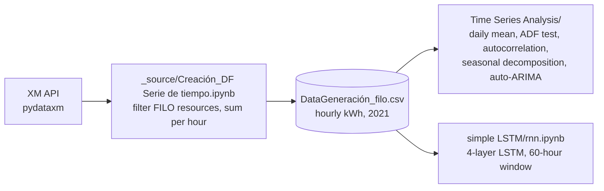
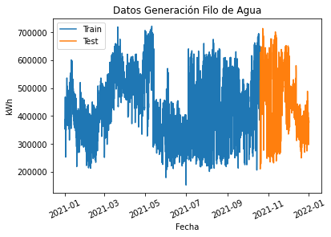
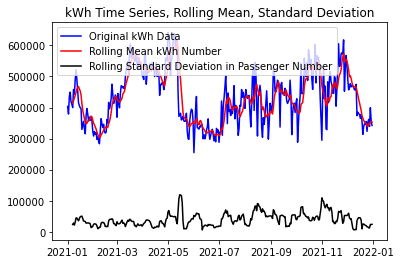
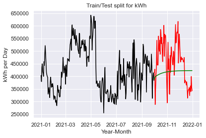
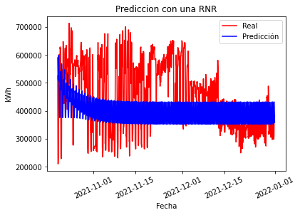

# cigrec2.5_spp_analytics

**Time-series analysis and forecasting of Colombian run-of-river hydro generation (2021) with statistical models (ARIMA) and an LSTM network.**


---

## Overview

This repository applies data analytics and deep learning to **small power plants (SPP)** based on hydraulic generation. It was developed within the **CIGRE C2.5 group** (see [CIGRE-C2.5](https://github.com/nensanc/CIGRE-C2.5)), whose goal is to apply AI models to power-system operation. The `Files/` folder holds notes from a CIGRE C2.5 talk with suggestions for this work, such as comparing against persistence and XM's redispatch schedule, trying ARIMA, and using MAPE.

The dataset is the **hourly generation (kWh) of all run-of-river ("filo de agua") resources in Colombia during 2021**. It was built from XM's public API with [`pydataxm`](https://pypi.org/project/pydataxm/):

1. Download the list of resources (`ListadoRecursos`) and the hourly generation per resource (`Gene` / `Recurso`).
2. Keep the resources whose type contains `FILO`.
3. Add them up per hour.

The result is `DataGeneración_filo.csv`, with 8,760 hourly rows in two columns: `Fecha` and `kWh`.

On that series, the notebooks run:

- an exploratory analysis: stationarity, autocorrelation and seasonal decomposition
- forecasting with **auto-ARIMA**
- forecasting with a **stacked LSTM**



## What's Included

| Part | Description |
|---|---|
| **Data extraction** (`_source/Creación_DF Serie de tiempo.ipynb`) | `ConsultaSinergox` class that wraps `pydataxm.ReadDB()`, turns the 24 hourly columns into a time series and exports the run-of-river total to CSV |
| **Full-year analysis** (`Time Series Analysis/main.ipynb`) | Daily average, 7-day rolling mean/std, Augmented Dickey-Fuller test, autocorrelation (1- and 3-day lags), additive seasonal decomposition (periods 1, 3, 7, 14, 30), auto-ARIMA trained on Jan–Sep and tested on Oct–Dec, RMSE |
| **Quarter / semester analysis** | The same steps per period: `main trimestre_1_2.ipynb` (Q1–Q2, with auto-ARIMA per quarter), `main_trimestre_3_4.ipynb` and `main_Prueba.ipynb` (Q3–Q4), `main_semestre1.ipynb`, `main_semestre2.ipynb` |
| **LSTM forecasting** (`simple LSTM/rnn.ipynb`) | 80/20 split (7,008 / 1,752 hours), Min-Max scaling, 60-hour input window, 4 stacked LSTM layers (50 units, dropout 0.2) + dense output. Loads the trained model from `LSTM.h5` and forecasts the test period, both one step ahead and recursively (feeding predictions back as inputs) |
| **LSTM tutorial example** (`simple LSTM/rnn_google.py`) | Script from a course tutorial (author: *juangabriel*, as stated in its header) that predicts Google stock prices with the same LSTM architecture, using `Google_Stock_Price_Train/Test.csv`. Kept as a learning reference; **it is not part of the main analysis** |
| **Supporting material** | CIGRE C2.5 talk notes (`Files/`), `Links de Interes`, and the papers listed under [References](#references) |

## Results

The plots below come from the notebooks' saved outputs.

| Run-of-river generation 2021 (train/test split used by the LSTM) | Daily average with 7-day rolling mean and std |
|---|---|
|  |  |

| auto-ARIMA: train (black), test (red), forecast (green) | LSTM: recursive forecast over the test period |
|---|---|
|  |  |

## Tech Stack

| Area | Libraries used in the code |
|---|---|
| Data access | `pydataxm` (XM API) |
| Data handling | `pandas`, `numpy` |
| Statistics | `statsmodels` (`adfuller`, `seasonal_decompose`), `pmdarima` (`auto_arima`, `ADFTest`), `scikit-learn` (`MinMaxScaler`, `mean_squared_error`) |
| Deep learning | `keras` (`Sequential`, `LSTM`, `Dropout`, `Dense`, `load_model`) |
| Plots | `matplotlib`, `seaborn` |

## Project Structure

```text
cigrec2.5_spp_analytics/
├── DataGeneración_filo.csv              # Hourly run-of-river generation, 2021 (kWh)
├── _source/
│   └── Creación_DF Serie de tiempo.ipynb # Builds the CSV from the XM API
├── Time Series Analysis/
│   ├── main.ipynb                       # Full-year analysis + auto-ARIMA
│   ├── main trimestre_1_2.ipynb         # Q1–Q2 analysis + auto-ARIMA per quarter
│   ├── main_trimestre_3_4.ipynb         # Q3–Q4 analysis
│   ├── main_Prueba.ipynb                # Q3–Q4 analysis (test copy)
│   ├── main_semestre1.ipynb             # First semester
│   └── main_semestre2.ipynb             # Second semester
├── simple LSTM/
│   ├── rnn.ipynb                        # LSTM forecast on the run-of-river series
│   ├── LSTM.h5                          # Trained LSTM model
│   ├── DataGeneración_filo.csv          # Copy of the dataset used by rnn.ipynb
│   ├── rnn_google.py                    # Course tutorial example (Google stock), not part of the analysis
│   └── Google_Stock_Price_Train.csv / _Test.csv   # Tutorial data
├── Files/                               # CIGRE C2.5 talk notes
├── Links de Interes                     # Useful links
├── docs/images/                         # Plots exported from the notebooks
└── LICENSE                              # MIT
```

## Getting Started

The repository has no requirements file. Install the libraries imported by the notebooks (the versions aren't pinned in the code):

```bash
pip install pandas numpy matplotlib seaborn statsmodels pmdarima scikit-learn keras pydataxm
```

`keras` needs a backend such as TensorFlow.

Then open the notebooks with Jupyter:

- **Time Series Analysis:** run from `Time Series Analysis/`. These notebooks read `../DataGeneración_filo.csv`.
- **LSTM:** run `simple LSTM/rnn.ipynb` from its folder. It reads its own copy of the CSV and loads `LSTM.h5`. The training code is in the notebook, commented out.
- **Rebuild the dataset:** run `_source/Creación_DF Serie de tiempo.ipynb`. It needs internet access to the XM API and writes `DataGeneración_filo.csv` in the working folder.

## Notes and Limitations

- `main_semestre1.ipynb`, `main_semestre2.ipynb`, `main_trimestre_3_4.ipynb` and `main_Prueba.ipynb` stop at the decomposition import, without running the decomposition.
- `main.py` and `_source/__init__.py` are empty.
- The dataset is duplicated in the root and in `simple LSTM/`.
- Notebook comments and plot labels are mostly in Spanish.

## References

Papers consulted during the project. The PDFs were removed from the repository; use the DOI links to access them.

1. P. Malhan and M. Mittal, "A novel ensemble model for long-term forecasting of wind and hydro power generation," *Energy Conversion and Management*, vol. 251, p. 114983, 2022. DOI: [10.1016/j.enconman.2021.114983](https://doi.org/10.1016/j.enconman.2021.114983)
2. R. Jiao, T. Zhang, Y. Jiang and H. He, "Short-Term Non-Residential Load Forecasting Based on Multiple Sequences LSTM Recurrent Neural Network," *IEEE Access*, vol. 6, pp. 59438–59448, 2018. DOI: [10.1109/ACCESS.2018.2873712](https://doi.org/10.1109/ACCESS.2018.2873712)
3. M. S. Hossain and H. Mahmood, "Short-Term Photovoltaic Power Forecasting Using an LSTM Neural Network and Synthetic Weather Forecast," *IEEE Access*, vol. 8, pp. 172524–172533, 2020. DOI: [10.1109/ACCESS.2020.3024901](https://doi.org/10.1109/ACCESS.2020.3024901)

## Authors

Developed by members of the CIGRE C2.5 group:

- **Martin Sanchez** ([@nensanc](https://github.com/nensanc))
- [@juan-suarezp](https://github.com/juan-suarezp)
- [@jsgaleano](https://github.com/jsgaleano)
- [@luis9504](https://github.com/luis9504)
- [@alejotf10](https://github.com/alejotf10)

## License

This project is licensed under the [MIT License](LICENSE).
